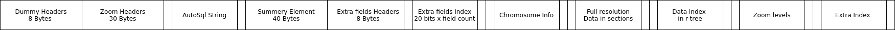

# rtracklayer-improvements-test

## Solutions

- ### Write a test for the track hub export feature (create_track_hub function) in the PeakSegPipeline package.
   [PeakSeg Pipeline create_track_hub Test](https://github.com/sanchit-saini/PeakSegPipeline/blob/test_create_track_hub_function/tests/testthat/test-CRAN-create-track-hub.R)


- ### Identify some of the functions in the [Kent library](https://github.com/ucscGenomeBrowser/kent/tree/master/src/lib) that would need to be called to read and write BigBed files. Explain (possibly with pseudocode that mentions those functions) how you plan to implement the read/write features.

    | Function |task       | Return  |
    | ------------- |:-------------:| -----:|
    | [bigBedFileOpen](https://github.com/ucscGenomeBrowser/kent/blob/981a56e061a1e3e9a54904f09eb17832151d20be/src/lib/bigBed.c#L23)|Open bigBed/bigWig File|struct bbiFile*|
    |[bigBedIntervalQuery](https://github.com/ucscGenomeBrowser/kent/blob/0ca4edff9bd7aefe16d3af95d137f61576539929/src/lib/bigBed.c#L35)|Get data for interval|struct bigBedInterval*|
    |[bbiChromList](https://github.com/ucscGenomeBrowser/kent/blob/0ca4edff9bd7aefe16d3af95d137f61576539929/src/lib/bbiRead.c#L219)|Return list of chromosomes|struct bbiChromInfo*|
    |[mustOpen](https://github.com/ucscGenomeBrowser/kent/blob/0ca4edff9bd7aefe16d3af95d137f61576539929/src/lib/common.c#L2587)|Open a file or squawk and die|FILE*|
    |[repeatCharOut](https://github.com/ucscGenomeBrowser/kent/blob/0ca4edff9bd7aefe16d3af95d137f61576539929/src/lib/common.c#L2347)|Write character to file repeatedly|void|
    |[mustWrite](https://github.com/ucscGenomeBrowser/kent/blob/0ca4edff9bd7aefe16d3af95d137f61576539929/src/lib/common.c#L2613)|Write to a file or squawk and die|void|
    |[bbiWriteDummyHeader](https://github.com/ucscGenomeBrowser/kent/blob/0ca4edff9bd7aefe16d3af95d137f61576539929/src/lib/bbiWrite.c#L18)|Write out all-zero header, just to reserve space for it|void|
    |[bbiWriteDummyZooms](https://github.com/ucscGenomeBrowser/kent/blob/0ca4edff9bd7aefe16d3af95d137f61576539929/src/lib/bbiWrite.c#L24)|Write out zeroes to reserve space for ten zoom levels|void|
    |[bbiSummaryElementWrite](https://github.com/ucscGenomeBrowser/kent/blob/0ca4edff9bd7aefe16d3af95d137f61576539929/src/lib/bbiWrite.c#L30)|Write out summary element to file|void|
    |[bbiWriteChromInfo](https://github.com/ucscGenomeBrowser/kent/blob/0ca4edff9bd7aefe16d3af95d137f61576539929/src/lib/bbiWrite.c#L50)|Write out information on chromosomes to file|void|
    |[bbiWriteZoomLevels](https://github.com/ucscGenomeBrowser/kent/blob/0ca4edff9bd7aefe16d3af95d137f61576539929/src/lib/bbiWrite.c#L283)|Write out all the zoom levels and return the number of levels written|int|
    |[bigBedFileClose](https://github.com/ucscGenomeBrowser/kent/blob/0ca4edff9bd7aefe16d3af95d137f61576539929/src/inc/bigBed.h#L62)|Close down a big wig/big bed file|void|
    #### bigBed File Layout
    
    #### Examples
    ##### Read bigBed
    1. Open bigBed file with the help of `bigBedFileOpen`
    2. Retrive list of chromosomes from file using `bbiChromList`
    3. Select chromosome infomation i.e name, start and end from list of chromosomes
    4. Query data for particular Interval with the help of `bigBedIntervalQuery`
    5. Do something involving chrom, el->start, el->end
    6. Clean Up with the help of `bigBedFileClose`, `bbiChromInfoFreeList`
    ```C
    struct bbiFile *bbi = bigBedFileOpen(fileName);
    struct bbiChromInfo *chromList = bbiChromList(bbi);
    struct bbiChromInfo *chrom = chromList;
    char *chromName = chrom->name;
    int start = 0, end = chrom->size;
    struct lm *lm = lmInit(0); // Memory pool to hold returned list
    struct bigBedInterval *list = bigBedIntervalQuery(bbi, chromName, start, end, 0, lm);
    struct bigBedInterval *el;
    for (el = list; el != NULL; el = el->next){
        // do something involving chrom, el->start, el->end
    }
    lmCleanup(&lm);         // typically do this after each query
    bigBedFileClose(&bbi);  // typically only do this when finished all queries
    bbiChromInfoFreeList(&chromList);
    ```
    
    ##### Write bigBed
    1. Read bed file line by line with `lineFileOpen` and chrom.sizes with `twoBitChromHash` if file is 2 bit file else with `bbiChromSizesFromFile`
    2. If extra fields are present read autoSql file and parse it with `asParseText`, Check Is it a valid autosql file with `asCompareObjAgainstStandardBed` if not throw an error and stop execution 
    3. Go through bed file and collect chromosomes and statistics with `bbiChromUsageFromBedFile`
    4. Open bigBed file with the help of `mustOpen`
    5. Write out dummy headers to reserve space for later with `bbiWriteDummyHeader` and `bbiWriteDummyZooms` on bigBed file
    6. If extra fields are present write out autoSql string with `mustWrite` on bigBed file
    7. Write out dummy total summary with `bbiSummaryElementWrite`
    8. If extra fields are present write out extra fields header and index
    9. Calculate number of zoom levels with `bbiCalcResScalesAndSizes`
    10. Write out primary full resolution data in sections, collect stats to use for reductions.
    11. Write out primary data index inside the tree
    12. Write out zoom levels on bigbed file.
    13. If extra fields are present write out extra fields index
    14. Go back and rewrite header 
    15. Write end signature and free used memory


- ### Use the restfulr package to retrieve the list of available UCSC genomes from their REST API. Provide a link to a web page with your R code and results/output (possibly using Rmd/Rpubs, http://rpubs.com/).
    
    [Link for Compiled Markdown Hosted on Rpubs](http://rpubs.com/sanchit-saini/ucsc_genomes_list)
    ```R
    # Checking requirements are installed if not, then install the required packages
    if (!requireNamespace("BiocManager", quietly = TRUE))
    install.packages("BiocManager")

    if(!require(S4Vectors))
    BiocManager::install("S4Vectors")
    
    if(!require(restfulr))
    install.packages("restfulr")
  
    library(restfulr)
    
    # Solution: Fetch list of available UCSC genomes 
    api_genome <- RestUri("http://api.genome.ucsc.edu/list")
    response <- read(api_genome$ucscGenomes)
    genomes_list <-do.call(rbind.data.frame, response$ucscGenomes)
    knitr::kable(genomes_list, caption = "List of UCSC genomes")
    ```
